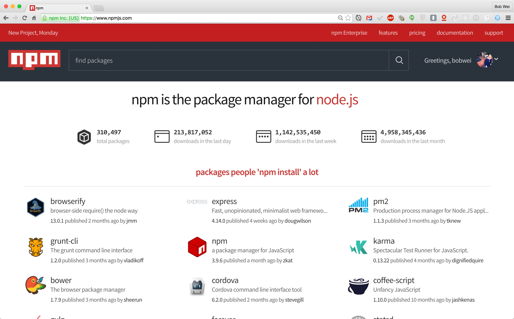

# 如何模組化妳的 React Component

<span class="author">
  Author : [Bob Wei](http://bobwei.com)
</span>

* [NPM](#npm)
* [初始化 npm package](#初始化-npm-package)
* [建立 nodejs module](#建立-nodejs-module)


## NPM




## 初始化 npm package

建立 my-react-component-module 資料夾並自動產生 package.json 檔

```
mkdir my-react-component-module && cd my-react-component-module
```

```
npm init
```

## 建立 node.js module

假設我們現在想要建立一個 Button 的模組，我們可以在 src/components/ 底下，建立一個 Button 的資料夾，並長得像以下的資料夾結構

```
.
├── README.md
├── package.json
└── src
    ├── components
    │   └── Button
    │       ├── Button.js
    │       └── Button.scss
    └── index.js
```

src/components/Button.js

Button.js 就是我們 component code 的地方，把跟此 component 有關的邏輯都放在此

```
import React from 'react';

const Button = (props = {}) => (
  <a className="btn">
    {props.value}
  </a>
);

export default Button;

Button.propTypes = {
  value: React.PropTypes.string.isRequired,
};
```

src/index.js

除了 Button.js component 外，我們還需要一個 index.js ，把需要對外 export 的 module 在此處 export

```
import Button from './components/Button/Button';

export { Button };
```

package.json

還記得前面 npm init 時候建立的 package.json 嗎？他描述了此 module 的用途、相依性以及其他人要如何使用你的 module。其中的 main 欄位，就指向了此 module 的進入點。

```
{
  "name": "react-component-module-template",
  "version": "1.0.0",
  "description": "",
  "main": "lib/index.js",
  "scripts": {
    "build": "babel src --out-dir lib",
    "start": "node src/index.js",
    "test": "echo \"Error: no test specified\" && exit 1"
  },
  "author": "bob61016@gmail.com",
  "license": "MIT",
  "devDependencies": {
    "babel-cli": "^6.10.1",
    "babel-core": "^6.10.4",
    "babel-eslint": "^6.1.0",
    "babel-loader": "^6.2.4",
    "babel-plugin-transform-object-rest-spread": "^6.8.0",
    "babel-preset-es2015": "^6.9.0",
    "babel-preset-react": "^6.11.1",
    "eslint": "^2.13.1",
    "eslint-config-airbnb": "^9.0.1",
    "eslint-plugin-import": "^1.8.1",
    "eslint-plugin-jsx-a11y": "^1.4.2",
    "eslint-plugin-react": "^5.1.1",
    "webpack": "^1.13.1"
  },
  "dependencies": {
    "react": "^15.2.0"
  }
}

```


## Reference

* [How to Create and Publish Your First Node.js Module](https://medium.com/@jdaudier/how-to-create-and-publish-your-first-node-js-module-444e7585b738#.h3rylvvah)

<style type="text/css">
  .author {
    display: block;
    text-align: right;
  }
</style>
