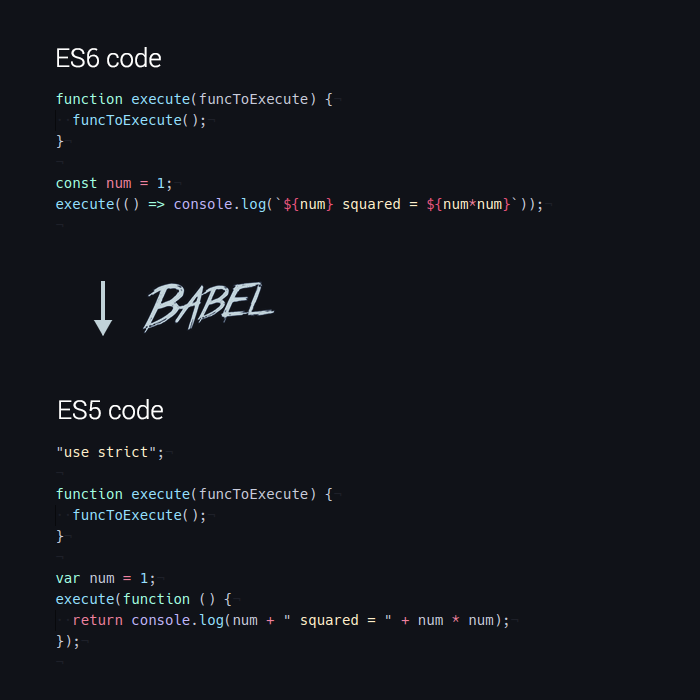

# 如何模組化妳的 React Component - 2

<span class="author">
  Author : [Bob Wei](https://fb.me/coolyu)
</span>

* [將妳的 component 轉譯至 ES6](#將妳的-component-轉譯至-ES6)
* [發佈妳的 component 至 npm](#發佈妳的-component-至-npm)


## 將妳的 component 轉譯至 ES6



在進行轉譯 ( transpile ) 之前，我們需要將相關轉譯工具準備好。

package.json
```
{
  "name": "my-react-component-module",
  ...
  "devDependencies": {
    "babel-cli": "^6.10.1",
    "babel-core": "^6.10.4",
    "babel-eslint": "^6.1.0",
    "babel-loader": "^6.2.4",
    "babel-plugin-transform-object-rest-spread": "^6.8.0",
    "babel-preset-es2015": "^6.9.0",
    "babel-preset-react": "^6.11.1",
    "eslint": "^2.13.1",
    "eslint-config-airbnb": "^9.0.1",
    "eslint-plugin-import": "^1.8.1",
    "eslint-plugin-jsx-a11y": "^1.4.2",
    "eslint-plugin-react": "^5.1.1",
    "webpack": "^1.13.1"
  }
}
```

.babelrc
```
{
  "presets": [
    "es2015",
    "react"
  ],
  "plugins": [
    "babel-plugin-transform-object-rest-spread"
  ]
}
```

```
npm install
```

相關轉譯工具安裝好後，即可進行轉譯。透過以下指令，可以將 src/ 資料夾下的所有 js 檔，編譯成 ES6，並輸出至 lib/ 資料夾

```
babel src --out-dir lib
```

除了可以直接於 console 輸入以上指令外，npm 提供了一個方法讓妳可以自訂指令集，透過指令集的組合，可以簡化各種流程，包含部署、發佈與測試

```
{
  "name": "my-react-component-module",
  ...
  "scripts": {
    "build": "babel src --out-dir lib",
    "prepublish": "npm run build",
    "start": "node src/index.js",
    "test": "echo \"Error: no test specified\" && exit 1"
  }
}

```

定義好指令集後，可以透過以下指令進行轉譯

```
npm run build
```


## 發佈妳的 component 至 npm

```
npm publish
```

發佈至 npm 後，其他人就可以透過以下指令來使用妳的 module 囉～

```
npm install --save my-react-component-module
```


## Reference

* [How to Create and Publish Your First Node.js Module](https://medium.com/@jdaudier/how-to-create-and-publish-your-first-node-js-module-444e7585b738#.h3rylvvah)
* [How to Build and Publish ES6 npm Modules Today, with Babel](https://booker.codes/how-to-build-and-publish-es6-npm-modules-today-with-babel/)

<style type="text/css">
  .author {
    display: block;
    text-align: right;
  }
</style>
